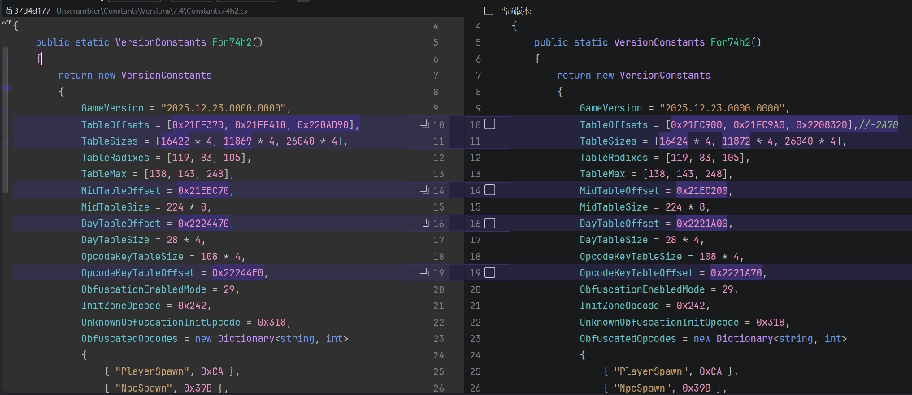

> 这里介绍了CN服如何修改

以7.40patch2为例。

# 缓兵之计(等上游更新)

虽然CN服与国际服已经同步，但是客户端依旧有部分差异。IINACT使用Unscrambler进行网络包的反混淆，并且使用固定偏移生成Table，所以国际服与国服会存在数据上的差别(
如ACT的伤害日志错误)。如果需要快速修复，可以用我编译好的包里的Unscrambler.dll替换掉即可。完整的从头修复的方案如下(
其实也不是从头，我ida也没怎么搞明白)：

1. 等待上游 https://github.com/perchbirdd/Unscrambler 更新到当前版本。(因为我不知道怎么自己找)。然后git clone到本地。
2. 找到最新的Constants文件(Unscrambler/Constants/Versions/7.4/Constants74h2.cs，记得换为当前版本)
   。这里我们着重关注TableOffset，并稍微关注一下TableSize。以变量TableOffsets的第一个值(0x21EF370)
   为例，首先需要获取一下FFXIV的国际服客户端。然后打开ida，载入国际服客户端，在IDA View-A中右键左侧的地址(类似.rdata:
   000000014XXXXXXX，我不清楚这个14会不会变，后续会用到),右键Jump to address，输入1421EF370，OK之后会发现指向了一个类似(
   .rdata:000000014YYYYYYY dword_ZZZZZZZZZ)的地方，选中这个值，点开Hex View-1，右键Synchronize with -> IDA
   View-A，会高亮出前几个字节，将这几个字节及后面一些字节(10个左右，不用太多，能保证唯一性就行)作为特征Sig复制出来。
3. 打开一个新的ida，载入CN客户端，菜单栏Search -> Sequence of bytes，输入刚才复制的Sig，OK后会跳到一个类似(.rdata:
   000000014AAAAAAA dword_BBBBBBBBB)的地方，这里的AAAAAAA就是我们要找的值(21EC900)
   。将上文的0x21EF370替换为0x21EC900即可，其余TableOffset如法炮制(
   TableOffsets，MidTableOffset，DayTableOffset，OpcodeKeyTableOffset)
4. [小贴士] 由于客户端结构相似，在示例版本中，所有TableOffset都满足: 国际服-CN=(0x21EF370-0x21EC900)
   =0x2A70，所以理论上你找到第一个偏差之后，其余的只要在国际服基础上-0x2A70就可以了
5. [可选] 其实到这里就基本可以结束了，如果想要更精确一些，可以修改TableSize。只需要右键点击dword_BBBBBBBBB，点击Array，就可以看到Array
   Size了。不过一般不需要改，因为客户端结构相似。
6. 然后就是编译了。
   在这之前，请确保ConstantsXX.cs已被正确修改。首先构建Unscrambler.DataGenerator，然后运行的时候需要两个参数(
   游戏路径，生成路径)，cd到编译后的目录，执行(Unscrambler.DataGenerator.exe "C:\Program Files (x86)
   \上海数龙科技有限公司\最终幻想XIV\game\ffxiv_dx11.exe" .)就行了。然后会在生成路径(.)
   中找到当前游戏版本号的文件夹，将文件夹复制到Unscrambler\Data文件夹，如果你使用的是支持Git的IDE，可以看到tableX.bin有修改。然后再构建Unscrambler，将生成的dll直接替换掉IINACT编译目录下的Unscrambler就可以完成修复。



# 自食其力(自己改)

原文(在下面)的Readme介绍了相关数据结构。

由于我的IDA不知道什么毛病，原文中的`Derive`函数无法正确反编译(F5返回空函数体)
；FFXIVClientStructs也不知道什么毛病，无法正确映射相关函数名称。但是没关系，还是可以看的，就是稍微看起来不够直观一些。本流程使用IDA
Pro
7.7/9.2，无需Python环境，导入exe时无需开启Analysis，无需Pdb。

小提示：14为一些地址开头，我们要找的是14后面的地址。

1. 找到`Client::Network::PacketDispatcher_OnReceivePacket`函数(也可能找到的是内层函数)。
   由于FFXIVClientStructs无法正确标记函数名称，我们使用签名进行函数定位。
   在`IINACT\Network\ZoneDownHookManager.cs`中，可以找到该函数的sig(可能随版本变化，不一定每个版本都会变):

```c#
private const string OpcodeKeyTableSignature = "?? ?? ?? 2B C8 ?? 8B ?? 8A ?? ?? ?? ?? 41 81";
```

IDA->Search->Sequence of bytes->输入?? ?? ?? 2B C8 ?? 8B ?? 8A ?? ?? ?? ?? 41 81->OK->回车->F5->F5。

2. 寻找Derive函数表格区域，ObfuscationEnabledMode，UnknownObfuscationInitOpcode。

在上述函数的靠前位置寻找类似区域：

```c++
//上面是一大堆寄存器和变量定义
char v183; // [rsp+3C78h] [rbp+3B78h]

  v3 = *(unsigned __int16 *)(a3 + 2);
  if ( v3 == 792 ) // UnknownObfuscationInitOpcode
  {
    v7 = *(_BYTE *)(a3 + 22);
    v149 = (int)sub_141D29D70() % 255 + 1;
    a1[7] = v149;
    if ( v7 == 29 ) // ObfuscationEnabledMode
    {
      v8 = a1[6];
      sub_14181B130(); // Derive
      a1[8] = v8 + v149 + v9;
      sub_14181B130(); // Derive
      a1[9] = v149 + v8 + v10;
      sub_14181B130(); // Derive
      a1[10] = v149 + v8 + v11;
    }
    else
    {
      a1[8] = (unsigned int)sub_141D29D70() % (a1[6] + a1[7]);
      a1[9] = (unsigned int)sub_141D29D70() % (a1[6] + a1[7]);
      a1[10] = (unsigned int)sub_141D29D70() % (a1[6] + a1[7]);
    }
  }
  v12 = a1[7];
  v13 = a1[6];
  v14 = 0;
  v12 = a1[7];
  v13 = a1[6];
  v14 = 0;
  if ( a1[8] < (unsigned int)(v13 + v12) )
    goto LABEL_100;
  v15 = a1[v3 % 3 + 8] - v13 - v12;
  v16 = dword_142221A70[(v15 + v3) % 0x6C]; //OpcodeKeyTableOffset
  if ( v3 > 0x185 )
  {
    if ( v3 <= 0x253 )
    {
      if ( v3 != 595 )
      {
        switch ( v3 )
//下面是一大堆switch-case，用于OpCode分包
```

ObfuscationEnabledMode就在注释中，为29。UnknownObfuscationInitOpcode就在注释中，为792

由于IDA抽风的原因，每次打开对于`Derive`函数的描述可能有差异，具体表现为：这个语句可以类似

```c++
a1[8] = v137 + v10 + sub_14181B130(0, v7, v9, v136);
```

也可以类似

```c++
sub_14181B130();
a1[8] = v8 + v149 + v9;
```

不管怎么样，sub_14181B130就是我们要找的`Derive`函数，181B130这个地址会随版本变化而变化。
IDA->View->Open subviews->Disassembly->右键左侧地址区域->Jump to address->输入`Derive`函数地址(14181B130)，就可以看到
`Derive`函数，类似于

```asm
.text:000000014181B130 ; void sub_14181B130()
.text:000000014181B130 sub_14181B130   proc near               ; CODE XREF: sub_1418157A0+F0↑p
.text:000000014181B130                                         ; sub_1418157A0+10D↑p ...
.text:000000014181B130
.text:000000014181B130 arg_0           = qword ptr  8
.text:000000014181B130 arg_8           = qword ptr  10h
.text:000000014181B130
.text:000000014181B130                 mov     [rsp+arg_8], rsi
.text:000000014181B135                 push    rdi
.text:000000014181B136                 movzx   esi, r8b
.text:000000014181B13A                 movzx   r8d, dl
.text:000000014181B13E                 movzx   r10d, cl
.text:000000014181B142                 test    cl, cl
.text:000000014181B144                 jz      loc_14181B2E9 ; 函数1
.text:000000014181B14A                 sub     r10d, 1
.text:000000014181B14E                 jz      loc_14181B24D ; 函数2
.text:000000014181B154                 cmp     r10d, 1
.text:000000014181B158                 jz      short loc_14181B163 ; 函数3
.text:000000014181B15A                 xor     eax, eax
.text:000000014181B15C                 mov     rsi, [rsp+8+arg_8]
.text:000000014181B161                 pop     rdi
.text:000000014181B162                 retn
```

我们要关注的就是函数123。

3. TableOffsets，TableRadixes，TableMax

这一步要找的语句类似于ds:rva dword_14XXXXXXX[YYYY]，以及往上的几行。

+ 双击函数1(loc_14181B2E9)，找到语句

```asm
.text:000000014181B367                 imul    eax, edx, 8Ah
.text:000000014181B36D                 sub     ecx, eax
.text:000000014181B36F                 mov     eax, ecx
.text:000000014181B371                 imul    rcx, rax, 77h ; 'w'
.text:000000014181B375                 add     r8, rcx
.text:000000014181B378                 mov     ecx, ds:rva dword_1421EC900[rdi+r8*4]
```

其中21EC900就是TableOffsets[0]，0x77=119就是TableRadixes[0]，0x8A=138就是TableMax[0]

+ 双击函数2(loc_14181B24D)，找到语句

```asm
.text:000000014181B2CB                 imul    eax, edx, 8Fh
.text:000000014181B2D1                 sub     ecx, eax
.text:000000014181B2D3                 mov     eax, ecx
.text:000000014181B2D5                 imul    rcx, rax, 53h ; 'S'
.text:000000014181B2D9                 add     r8, rcx
.text:000000014181B2DC                 mov     ecx, ds:rva dword_1421FC9A0[rdi+r8*4]
```

其中21FC9A0就是TableOffsets[1]，0x53=83就是TableRadixes[1]，0x8F=143就是TableMax[1]

+ 双击函数3(loc_14181B163)，这个结构比较复杂，我写了注释：

```asm
.text:000000014181B1C4                 imul    ecx, [r10+rdi+21EC200h]
; 一些东西
.text:000000014181B1FC                 imul    ecx, 0F8h
.text:000000014181B202                 sub     r8d, ecx
.text:000000014181B205                 mov     ecx, r8d
.text:000000014181B208                 imul    rdx, rcx, 69h ; 'i'
.text:000000014181B20C                 add     r9, rdx
.text:000000014181B20F                 mul     r11d
.text:000000014181B212                 mov     ecx, ds:rva dword_142208320[rdi+r9*4]
; 一些东西
.text:000000014181B22C                 add     ecx, ds:rva dword_142221A00[rdi+r11*4]
.text:000000014181B234                 add     ecx, [r10+rdi+21EC204h]
```

其中2208320就是TableOffsets[2]，0x69=105就是TableRadixes[2]，0xF8=248就是TableMax[2]

21EC200就是MidTableOffset，2221A00就是DayTableOffset，2221A70就是OpcodeKeyTableOffset。

OpcodeKeyTableOffset也可以通过上述第二步通过OpcodeKeyTableSignature定位时找到的类似于

```asm
 v16 = dword_142221A70[(v15 + v3) % 0x6C];
```

的语句来定位

21EC204没用到，原文中反编译代码类似

```asm
midTable[4 + midIndex]
```

应该是MidTableOffset下标固定偏移量

4. 其余小项目

GameVersion可以在C:\Program Files (x86)\上海数龙科技有限公司\最终幻想XIV\game\ffxivgame.ver中找到。

TableSizes可以通过：双击dword_XXXXXXXXX->右键dword_XXXXXXXXX->Array，就可以看到Array Size了。代码中后面乘的系数(4,8)
一般不会变，是根据变量的类型决定大小的。

InitZoneOpcode似乎在7.4后废弃了(?)，其和ObfuscatedOpcodes的定位方式有这些办法：

- https://cdn.jsdelivr.net/gh/karashiiro/FFXIVOpcodes@latest/opcodes.min.json
- https://github.com/xivdev/opcodediff/

> 以下是原版介绍

# Unscrambler
A library for deobfuscating packets for Final Fantasy XIV.

- [What is this?](#what-is-this)

  - [How does the obfuscation work?](#how-does-the-obfuscation-work)
  
  - [The Workaround, and "Why not hooking?"](#the-workaround-and-why-not-hooking)

- [Obfuscation Updates](#obfuscation-updates)

  - [7.3 Changes](#73-changes)
  - [7.3 API Updates](#73-api-updates)
  - [7.4 Changes](#74-changes)
  - [7.4 API Updates](#74-api-updates)

- [Using the library](#using-the-library)

  - [Extra considerations](#extra-considerations)

- [DataGenerator](#datagenerator)

  - [Updating values for DataGenerator](#updating-values-for-datagenerator)

- [Self Test](#self-test)

- [Important Notices](#important-notices)
  - [ActorControl](#actorcontrol)
  - [ActorCast](#actorcast)

# What is this?
In 7.2 (2025.03.18.0000.0000), released 3/25/2025, Square Enix implemented obfuscation for specific packets used in the
game. Prior to 7.2, there were still a number of applications that used packet capture (Npcap, Sockets) rather than
hooking game functions, in order to obtain packet data from the game. In the time since the release of 7.2, most 
applications that utilize packet capture have moved on to using [Deucalion](https://github.com/ff14wed/deucalion). 
Deucalion itself has had to modify its approach to obtain packets after the game deobfuscates them. This library 
attempts to make packet deobfuscation as simple as possible and provide a reference for the constants and data that 
make up the obfuscation method.

## How does the obfuscation work?
A basic understanding of [XIV packet structure](https://xiv.dev/network/packet-structure) is necessary for the 
following explanation.

The game receives packets, commonly referred to as frames, in order to function. These frames contain many packets 
inside them, so the terminology might get a little confusing. We will be referring to the entire payload as a "frame",
each packet element inside of a frame as a "packet" and the headers will be called packet headers and IPC headers.

In 7.2, when the game processes a zone down packet, it's processed by the zone down handler. This is where the 
deobfuscation begins. See the decompilation below:

```c++
unsigned __int64 __fastcall Client::Network::PacketDispatcher_OnReceivePacket(
        PacketDispatcher *this,
        unsigned int targetId,
        __int64 packet)

    opcode = *(unsigned __int16 *)(packet + 2);
    data = (byte *)packet;
    if ( opcode == 636 ) // Check for the InitZone opcode
    {
        mode = *(_BYTE *)(packet + 37);
        seed0 = *(_BYTE *)(packet + 38);
        seed1 = *(_BYTE *)(packet + 39);
        seed2 = *(_DWORD *)(packet + 40);
    }
    else
    {
        if ( opcode != 702 ) // Unknown opcode
          goto LABEL_8;
        mode = *(_BYTE *)(packet + 22);
        seed0 = *(_BYTE *)(packet + 23);
        seed1 = *(_BYTE *)(packet + 24);
        seed2 = *(_DWORD *)(packet + 28);
    }
    negSeed0 = ~seed0;
    negSeed1 = ~seed1;
    negSeed2 = ~seed2;
    packetRand = rand() % 255 + 1;        // Generate a random value
    this->lastPacketRand = packetRand;    // Store it for use later
    
    // This is the value that determines if obfuscation is enabled
    // This changes every patch
    if ( mode == -32 )
    {
        // LocalRand is a random number generated in the constructor of PacketDispatcher
        localRand = this->localRand; 
        this->key0 = localRand + packetRand + derive(0, negSeed0, negSeed1, negSeed2);
        this->key1 = localRand + packetRand + derive(1, negSeed0, negSeed1, negSeed2);
        this->key2 = localRand + packetRand + derive(2, negSeed0, negSeed1, negSeed2);
    }
    else
    {
        // This essentially turns obfuscation off - the keys are just the random values added 
        this->key0 = rand() % (this->lastPacketRand + this->localRand);
        this->key1 = rand() % (this->lastPacketRand + this->localRand);
        this->key2 = rand() % (this->lastPacketRand + this->localRand);
    }
```

and the `derive` function:

```c++
__int64 __fastcall derive(char set, byte nSeed1, byte nSeed2, unsigned int epoch)
{
  if ( set )
  {
    if ( set == 1 )
    {
      seed1_ = nSeed1;
      daysValue = 3 * (epoch / 0x3C / 0x3C / 0x18);
      midIndex = 8LL * (nSeed1 % 0xD5u);
      v8 = table1[105 * (nSeed2 % 0x7Fu)
                         + *(_DWORD *)((char *)&midTable + midIndex) * (unsigned int)nSeed1 % 0x69];
    }
    else
    {
      if ( set != 2 )
        return 0;
      seed1_ = nSeed1;
      daysValue = 3 * (epoch / 0x3C / 0x3C / 0x18);
      midIndex = 8LL * (nSeed1 % 0xD5u);
      v8 = table2[101 * (nSeed2 % 0xFAu)
                         + *(_DWORD *)((char *)&midTable + midIndex) * (unsigned int)nSeed1 % 0x65];
    }
  }
  else
  {
    seed1_ = nSeed1;
    daysValue = 3 * (epoch / 0x3C / 0x3C / 0x18);
    midIndex = 8LL * (nSeed1 % 0xD5u);
    v8 = table0[116 * (nSeed2 % 0xA6u)
                       + *(_DWORD *)((char *)&midTable + midIndex) * (unsigned int)nSeed1 % 0x74];
  }
  return (unsigned __int8)(seed1_ + midTable[4 + midIndex] + dayTable[4 * (daysValue % 0x25)] + v8);
}
```

Cleaned up, this is, in C#:

```csharp
private void Derive(byte set, byte nSeed1, byte nSeed2, uint epoch)
{
    var midIndex = 8 * (nSeed1 % ((_midTable.Length / 8) - 1));
    var midTableValue = _midTable[4 + midIndex];
    var midValue = BitConverter.ToUInt32(_midTable, midIndex);
    
    var epochDays = 3 * (epoch / 60 / 60 / 24);
    var dayTableIndex = 4 * (epochDays % 37);
    var dayTableValue = _dayTable[dayTableIndex];

    var setRadix = _constants.TableRadixes[set]; // [116, 105, 101] 
    var setMax = _constants.TableMax[set];       // [166, 127, 250]
    var tableIndex = setRadix * (nSeed2 % setMax) + midValue * nSeed1 % setRadix;
    var setResult = set switch
    {
        0 => _table0[tableIndex],
        1 => _table1[tableIndex],
        2 => _table2[tableIndex],
        _ => 0,
    };
    
    return (byte)(nSeed1 + midTableValue + dayTableValue + setResult);
}
```

I don't know enough about cryptography to go into heavy detail here, so a basic explanation is that there are 5 
distinct components to the keys: nSeed1, midTableValue, dayTableValue, setResult, and of course, the tables themselves.

The first part is nSeed1, which is just sent to the client.

The second part is the "midtable". I called it this because it's used in the middle of the calculation of things. The 
table itself seems to be sets of 8 bytes, the first 4 of which are used as an index modifier for each set's table. The
second 4 are truncated to a byte, and used in the final key calculation for each set.

The third part is the "daytable". This is a set of 37 ints, and the index is the InitZone-provided epoch day times 3, 
mod 37. Again, the values seem to be constrained to a 2 byte maximum, but take up 4, and are truncated to 1.

The fourth part and fifth part is setResult and their tables. Each table is a varying size, but you can see in the 
middle of this excerpt that these values are defined as "radix" and "max". I don't know enough math to describe this 
well, but to me, it looks like these tables are indexes using custom bases. That is, seed2 defines the Nths place, 
and seed1 defines the N-1ths place, where N is `TableRadixes[set]`. Does this make sense? No idea, but 
`TableRadixes[0] * TableMax[0] = sizeof(table0) / 4` so it sure made sense to me. As for the values in these tables, I
have absolutely no idea what they are. They just look like random ints constrained to 2 bytes.

Finally, seed1 is added to midTableValue which is added to dayTableValue which is added to setResult, and all truncated 
into one byte. That is the key for this set.

You may have noticed the random numbers that are added to the result of the `derive` function. Here is the code that 
determines the key to use:

```c++
lastPacketRand = this->lastPacketRand;
localRand = this->localRand;
if ( this->rspSeed1 < localRand + lastPacketRand )
    goto LABEL_109;
keyToUse = *(&this->key0 + opcode % 3) - localRand - lastPacketRand;
```
The conditional here is what causes the "obfuscation disable" to work. If the mode in an InitZone is not the mode to 
use the derive function, the keys will always end up less than the sum of the two random values. Prior to use, the 
first key is always checked to see if it's lower than these two values. If it is, deobfuscation is skipped. If it
isn't, it continues, subtracting these values from the derived keys in order to use them. Finally, the key to use is 
determined by the obfuscated packet's opcode.

For an example, we will focus on PlayerSpawn as it's the most interesting and also the most simple.

Here is the decompilation:
```c++
case 0x3A4u:
  MemCpy(v131, data, 0x10A0u);
  *(_WORD *)&v131[36] -= key;
  data = v131;
  v74 = 0;
  *(_QWORD *)&v131[24] -= key;
  v75 = &v131[611];
  *(_WORD *)&v131[38] -= key;
  do
  {
    *(v75 - 1) -= key;
    v74 += 32;
    *v75 -= key;
    v75[1] -= key;
    v75[2] -= key;
    v75[3] -= key;
    v75[4] -= key;
    v75[5] -= key;
    v75[6] -= key;
    v75[7] -= key;
    v75[8] -= key;
    v75[9] -= key;
    v75[10] -= key;
    v75[11] -= key;
    v75[12] -= key;
    v75[13] -= key;
    v75[14] -= key;
    v75[15] -= key;
    v75[16] -= key;
    v75[17] -= key;
    v75[18] -= key;
    v75[19] -= key;
    v75[20] -= key;
    v75[21] -= key;
    v75[22] -= key;
    v75[23] -= key;
    v75[24] -= key;
    v75[25] -= key;
    v75[26] -= key;
    v75[27] -= key;
    v75[28] -= key;
    v75[29] -= key;
    v75[30] -= key;
    v75 += 32;
  }
  while ( v74 < 0x20 );
  v76 = 0;
  v77 = &v131[564];
  v78 = key + 118426275;
  do
  {
    *((_DWORD *)v77 - 2) ^= v78;
    v76 += 10;
    *((_DWORD *)v77 - 1) ^= v78;
    *(_DWORD *)v77 ^= v78;
    *((_DWORD *)v77 + 1) ^= v78;
    *((_DWORD *)v77 + 2) ^= v78;
    *((_DWORD *)v77 + 3) ^= v78;
    *((_DWORD *)v77 + 4) ^= v78;
    *((_DWORD *)v77 + 5) ^= v78;
    *((_DWORD *)v77 + 6) ^= v78;
    *((_DWORD *)v77 + 7) ^= v78;
    v77 += 40;
  }
  while ( v76 < 0xA );
  break;
```

As you can see, these loops actually do nothing. If we clean it up a little, we get the following:

```c++
case 0x3A4u:
  MemCpy(v131, data, 0x10A0u);
  *(_WORD *)&v131[36] -= key;
  data = v131;
  v74 = 0;
  *(_QWORD *)&v131[24] -= key;
  v75 = &v131[610];
  *(_WORD *)&v131[38] -= key;
  for (int i = 0; i < 32; i++) {
    v75[i] -= key;
  }
  
  v76 = 0;
  v77 = &v131[564];
  intKey = key + 118426275;
  for (int i = 0; i < 10; i++) {
    *(_DWORD *)v77 ^= intKey;
  }
  break;
```

That's a lot better, but let's make one last pass (for understanding, not for copy-pasting):

```c++
case 0x3A4u: // PlayerSpawn opcode
  *(int64 *)&data[24] -= key; // Content ID
  *(int16 *)&data[36] -= key; // Home world
  *(int16 *)&data[38] -= key; // Current world
  
  // Player Name
  for (int i = 610; i < 610 + 32; i++) {
    data[i] -= key;
  }
  
  // Player equipment
  intKey = key + 118426275;
  for (int i = 556; i < 556 + 10; i++) {
    *(int32 *)(data + i) ^= intKey;
  }
  break;
```

Now we can see that these weirdly decompiled cases are just unrolled loops, smashing the provided key together with 
areas in packets that Square Enix doesn't want you to see, I guess. Every other packet is like this, only 
deobfuscating specific fields. The full reimplementation of the deobfuscation is in this library.

## The Workaround, and "Why not hooking?"

Since the 7.2 updates that have made various tools compatible with these changes in the game, there have been a number
of reports of crashes when running two applications that use the "deobfuscation workaround" in unison.

Take a look at this decompilation:
```c++
  } // End deobfuscation switch
LABEL_108:
  CreateTargetIfNeeded(targetId);
  opcodeMinus101 = opcode - 101;
LABEL_110:
  v90 = v85;
  v89 = &_ImageBase;
  result = opcodeMinus101;
  switch ( opcodeMinus101 ) // Begin packet handler switch
```

Prior to this CreateTarget, as it's known, being called, the pointer to the deobfuscated data actually 
ends up in `rsi`. This means that if you can access `rsi` from a hook, you can simply read the deobfuscated packet 
from the pointer, deobfuscated by the game, always 100% correct. The problem that the community has encountered is 
that `rsi` might not be maintained between different applications hooking the same callsite - and libraries that 
perform hooking may do funky things in order to provide `rsi` from within your hook, which may cause problems for 
other applications hooking the same location. Furthermore, even if you do get the data from this position, there are a 
number of new concerns to address. Packet ordering is one, where in order to maintain the actual order of incoming and
outgoing frames, you must delay processing an early frame until CreateTarget is hit, so you can read the packet from
`rsi` and fill in the missing data before considering the frame complete. Another concern is actually bugs in the
game - there is a certain IPC packet the server sends the client every 10 seconds, and if you happen to switch zones
and receive a type 2 packet (IPC is type 3), the game will send you both in the same frame - but it will not call
CreateTarget on this IPC packet. If the game sends you this packet outside of a frame with a type 2 packet, it will 
call CreateTarget on it. I was tired of the constant workarounds to ensure the integrity of my data.

# Obfuscation Updates

## 7.3 Changes

Patch 7.3 brought one major change to the obfuscation. Previously, almost every packet had its own hardcoded constant 
applied to certain fields. This was in addition to the single obfuscation key derived from data sent by the server. 

For example, consider `UpdateGearSet` in 7.25 hotfix 3:
```C
MemCpy(tmpPacket, packet, 0x10A0u);
iter = 0;
obfStart = &tmpPacket[44];
compoundKey = baseKey - 863169860;
packet = tmpPacket;
do
{
    *(obfStart - 2) ^= compoundKey;
    iter += 10;
    *(obfStart - 1) ^= compoundKey;
    *obfStart ^= compoundKey;
    obfStart[1] ^= compoundKey;
    obfStart[2] ^= compoundKey;
    obfStart[3] ^= compoundKey;
    obfStart[4] ^= compoundKey;
    obfStart[5] ^= compoundKey;
    obfStart[6] ^= compoundKey;
    obfStart[7] ^= compoundKey;
    obfStart += 10;
}
while ( iter < 0xA );
```

versus `UpdateGearSet` in 7.3:
```C
baseKey = this.keys[opcode % 3] - lastPacketRand - gameRand;
opcodeBasedKey = opcodeKeyTable[(baseKey + opcode) % 85];

// ...

case 0x2ACu:
    memmove(tmpPacket, (const void *)packet, 0x1B68u);
    iter = 0;
    compoundKey = opcodeBasedKey + baseKey;
    obfStart = &tmpPacket[44];
    do
    {
        *(obfStart - 2) ^= compoundKey;
        iter += 10;
        *(obfStart - 1) ^= compoundKey;
        *obfStart ^= compoundKey;
        obfStart[1] ^= compoundKey;
        obfStart[2] ^= compoundKey;
        obfStart[3] ^= compoundKey;
        obfStart[4] ^= compoundKey;
        obfStart[5] ^= compoundKey;
        obfStart[6] ^= compoundKey;
        obfStart[7] ^= compoundKey;
        obfStart += 10;
    }
    while ( v64 < 0xA );
```

It seems Square has caught on to the fact that their per-packet constants made it trivial to update this library every
patch, as the most time-consuming aspect is updating opcodes. Rather than making it constant, they decided to base it
on the other key, making this value now dependent on the server.

This is the only major change to the obfuscation in 7.3.

### 7.3 API Updates

- IKeyGenerator has a new method `GetOpcodeBasedKey` that accepts an opcode and will provide the appropriate
  `opcodeBasedKey` to pass to an IUnscrambler implementation for 7.3 unscrambling. This method throws an exception on
  `IKeyGenerator` implementations earlier than 7.3.
- IUnscrambler has a new signature for `Unscramble` that accepts an opcodeBasedKey. This method is required for 
  unscrambling on 7.3, and ignores this parameter when used on any earlier game version. Using the `Unscramble`
  signature that does not have this parameter on versions 7.3 and later will result in an exception.
- There is now an `OpcodeUtility` class that provides methods for working with opcodes. At the moment, it contains two
  methods, both of which return the opcode of a packet. `GetOpcodeFromPacketAtPacketStart` expects the provided
  Span to start at the packet header. `GetOpcodeFromPacketAtIpcStart` expects the Span to start at the IPC header.

## 7.4 Changes

Patch 7.4 brought one major change to the obfuscation. Previously, the InitZone packet, sent on every zone change, would
include the seed values required to generate keys. Another packet was able to initialize the obfuscation, but I had never
seen it used. Now this packet is the only way to initialize the obfuscation, and InitZone no longer includes the
seed values. Note that this packet is not necessarily sent on *every* zone change, so some zone changes may not incur a
key change.

### 7.4 API Updates

- IKeyGenerator has a new implementation for 7.4 while IUnscrambler does not.
- IKeyGenerator will now throw an exception when attempting to generate keys from InitZone packets in version 7.4 (
  2025.12.09.0000.0000) and later. This method will not be deprecated as it is still valid for 7.38 and earlier.
- InitZone opcodes may not be included in further VersionConstants objects.


# Using the library

## Installing

In the past, the library was only available via submodule. Now, the library is available via NuGet!

The versioning of the library is based on the game version. It will follow the format: "major.minor.hotfix.libVersion".
For example, the initial library version for 7.2 would be 7.2.0.0. 7.25 would be 7.25.0.0. After 1 hotfix on 7.25, the
library would become version 7.25.1.0. If there were updates or fixes to the library after that, the version would 
become 7.25.1.1.

## In code

The functionality is condensed into two classes, `KeyGenerator` and `Unscrambler`.

You obtain a `KeyGenerator` like so:
```csharp
var keyGenerator = KeyGeneratorFactory.ForGameVersion("2025.03.27.0000.0000");
```
and you feed it InitZone packets like so:
```csharp
if (packet.Opcode == VersionConstants.ForGameVersion("2025.03.27.0000.0000").InitZoneOpcode) {
    keyGenerator.GenerateFromInitZone(packet.Data);
    /*
    keyGenerator.DeobfuscationEnabled,
    keyGenerator.Keys[0],
    keyGenerator.Keys[1],
    keyGenerator.Keys[2]
    are all now set and ready to be used.
    */
}   
```
Note that you should also take care to provide UnknownInitializer packets, just in case. These have never
been seen in the wild, thus the name, but it doesn't hurt:
```csharp
if (packet.Opcode == VersionConstants.ForGameVersion("2025.03.27.0000.0000").UnknownObfuscationInitOpcode) {
    keyGenerator.GenerateFromUnknownInitializer(packet.Data);
}   
```

You obtain an instance of `Unscrambler` like so:
```csharp
var unscrambler = UnscramblerFactory.ForGameVersion("2025.03.27.0000.0000");
```
This is because the library will provide a dedicated implementation of IUnscrambler for each game version requested. 

You deobfuscate packets like so:
```csharp
var packetData = GetPacketDataAtIpcHeader();
var opcode = OpcodeUtility.GetOpcodeFromPacketAtIpcStart(packetData);
var opcodeBasedKey = keyGenerator.GetOpcodeBasedKey(opcode);
unscrambler.Unscramble(packetData, keyGenerator.Keys[0], keyGenerator.Keys[1], keyGenerator.Keys[2], opcodeBasedKey);
```
The unscrambler will deobfuscate the packet in-place. Note that the provided data must start at the IPC header. Not 
after the IPC header, but at the IPC header, as the function will obtain the opcode by accessing `data[2]`.

## Bypassing the KeyGenerator

With library version 7.31.1.0 for game version 2025.09.04.0000.0000/7.31 hotfix 1, the KeyGenerator is technically 
optional. If you would like, you can read keys directly from the game's PacketDispatcher class, and read the opcode key
table from memory. In this case, you can obtain an IUnscrambler via the UnscramblerFactory API or create your own
and initialize it with a constants object with only the opcode dictionary set, as that's all an IUnscrambler needs. From
there, you would use the signature that accepts the opcodeKeyTable `Span<int>` parameter, and the IUnscrambler 
will handle calculating the correct opcodeBasedKey and using that for deobfuscation.

## Extra considerations

The game client does not reset its generated keys between logins. Consider the following scenario:

1. ~~Log in~~
2. ~~Receive StatusEffectList3~~
   - ~~This is not obfuscated, as you have just logged in and no keys have been generated~~
3. ~~Receive InitZone~~
   - ~~Keys are now generated~~
4. ~~Do things in-game~~
5. ~~Log out~~
6. ~~Log in~~
7. ~~Receive StatusEffectList3~~
   - ~~This packet is obfuscated with keys from the last InitZone received~~
8. ~~Receive InitZone~~
   - ~~New keys have been generated~~

NOTE: This case technically is not valid due to research. The StatusEffectList3 sent by the client prior to InitZone
is technically a "throwaway" packet. I do not know why they did this, but instead of sending it after InitZone or
opting to not obfuscate this packet prior to InitZone, they decided to send a StatusEffectList3 prior to InitZone, and
then again after InitZone. The first one is useless and gets corrupted by the previous session's deobfuscation keys,
so they send it again after InitZone to actually provide the data.

Furthermore, care must be taken when generating keys and processing packets at a later time. For example, you may get
into a situation where a packet is being deobfuscated with new keys due to an error in the order of operations of
generating keys and deobfuscating the packet.

# DataGenerator

This repository comes with a project called Unscrambler.DataGenerator. Provided the appropriate values, this 
application will read the necessary key derivation tables from the executable and dump them into files to be
included in the library as constants. It's provided for convenience and my own use for updating the library.

## Updating values for DataGenerator

DataGenerator requires a set of constants in order to run. These are the table offsets and the table sizes.

If you look at the `derive` function in IDA, you will see the 5 tables referenced in an obvious fashion. There is an
example of this above in this README. If you click through to any of the set tables, you will see something like:
```asm
; int table1[13336]
table1          dd 1617h                ; DATA XREF: derive+169↑r
                db    4
                db  0Ch
                db    0
                db    0
                db  70h ; p
```
This shows the position of the table in the executable, and the length of the table in 32-bit integers. However, you
can also use the set code to determine the length:

```c++
setResult = table1[105 * (nSeed2 % 0x7Fu) + *(_DWORD *)((char *)&midTable + midIndex) * (unsigned int)nSeed1 % 0x69];
```
`0x69 * 0x7F = 105 * 127 = 13335` (Not sure why it's off by one, I thought this worked perfectly)

These set values above are the radix and max for table1. Doing this for each table will give you 3 radixes and 3 maxes.

IDA for some reason does not display the daytable size. But you can define it by a function of the epochDay mod - the
length is `(epochDayMod + 1) * 4` provided it stays a table of 4-byte ints.

The midtable's size is important because the length is used in this library to replace a runtime constant. But, you can
also compute the size, either via IDA, or by looking at the decompilation:
```c++
midIndex = 8LL * (nSeed1 % 0xD5u);
```
This shows the midtable has a max index of 0xD5 (213), so it has 214 entries and has 8-byte entries. The size is
then 213 * 8 = 1704 bytes. The table seems to be padded to the next 16 byte increment if the result is shorter. The 
only odd thing is that IDA detects the beginning of the midtable as an int prior to an array of bytes, so just know
that the use of the midtable in the set calculation is the correct base, not the array used in the return value, which
is 4 bytes later.

# Self-Test

This repository comes with a project called Unscrambler.SelfTest. This is a Dalamud plugin that performs the 
aforementioned `rsi` hooking in order to obtain the properly deobfuscated data from the game. It also loads all of the
obfuscated opcodes and displays which opcodes were and were not successfully deobfuscated. The code is very messy, but
it was created to do one job and it does it well enough. It, again, is provided for convenience and my own use for
verifying that updated versions of the library are functioning as expected. If you are using this to test updates,
note that there is likely no way to get the server to send a select few opcodes.

A general guideline is as follows:
- PlayerSpawn: Change zone or encounter another player
- NpcSpawn: Encounter a monster (BNpc)
- ActionEffect01: Observe an action that affects 1 target
- ActionEffect08: Observe an action that affects 8 targets
- ActionEffect16: Observe an action that affects 16 targets
- ActionEffect24: Observe an action that affects 24 targets (hunts are good for this)
- ActionEffect32: Observe an action that affects 32 targets (hunts are good for this)
- StatusEffectList1: Observe a buff being applied
- StatusEffectList3: Observe many buffs being applied (?)
- Examine: Examine another player
- UpdateGearset: Switch gearsets
- UpdateParty: Observe a player join/leave your party, or switch zones
- NpcSpawn2: Does not seem to be sent to the client
- ActionEffect02: Does not seem to be sent to the client
- ActionEffect04: Does not seem to be sent to the client
- UnknownEffect1: Does not seem to be sent to the client
- UnknownEffect16: Does not seem to be sent to the client


# Important Notices

Important notices regarding data captured with this library will be posted here.

### ActorControl

From
[its release on April 7th, 2025](https://github.com/perchbirdd/Unscrambler/commit/c1c4d0254f2b228e5a786b0b657576b8f1f79ea8) 
until 
[its update on May 27th, 2025](https://github.com/perchbirdd/Unscrambler/commit/2010d17f23ca7436a762aaff06c18fc4a2ade862), 
this library did not handle deobfuscating ActorControl packets with the type `TargetIcon`, commonly known as 
headmarkers. Any actor control packets with the TargetIcon type persisted on disk for later use must either be
deobfuscated after-the-fact by regenerating keys from InitZone packets, deriving the keys some other way, or entirely 
ignored. I apologize for any inconvenience.

### ActorCast

From
[its release on April 7th, 2025](https://github.com/perchbirdd/Unscrambler/commit/c1c4d0254f2b228e5a786b0b657576b8f1f79ea8)
until
[its update on August 5th, 2025](https://github.com/perchbirdd/Unscrambler/commit/c335cfb8b8c6bfabfe8273d8be703cfeaa6c602e),
this library did not handle deobfuscating ActorCast packets. Any actor cast packets persisted on disk for later use
must either be deobfuscated after-the-fact by regenerating keys from InitZone packets, deriving the keys some other 
way, or entirely ignored. I apologize for any inconvenience.

### ActionEffect02

From 
[its release on December 25th, 2025](https://github.com/perchbirdd/Unscrambler/commit/37d4d17787710584843b54ce74bf4845e2bdbce6)
until
[its update on January 27th, 2026](https://github.com/perchbirdd/Unscrambler/commit/e7746d384abca1a36878314529cf508b85c5bd88),
this library had the incorrect opcode for ActionEffect02 for 7.4 hotfix 2, game version 2025.12.23.0000.0000.
Although this opcode is not actually sent to the client, I apologize for any inconvenience. 